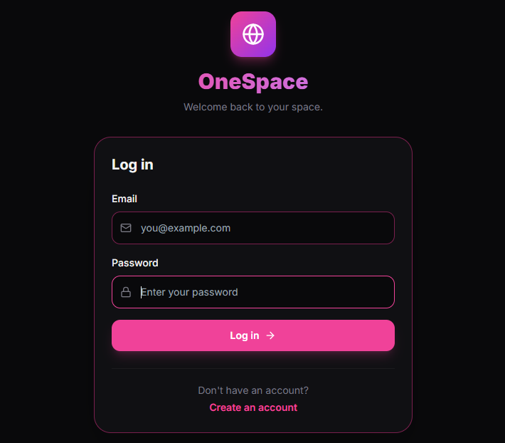
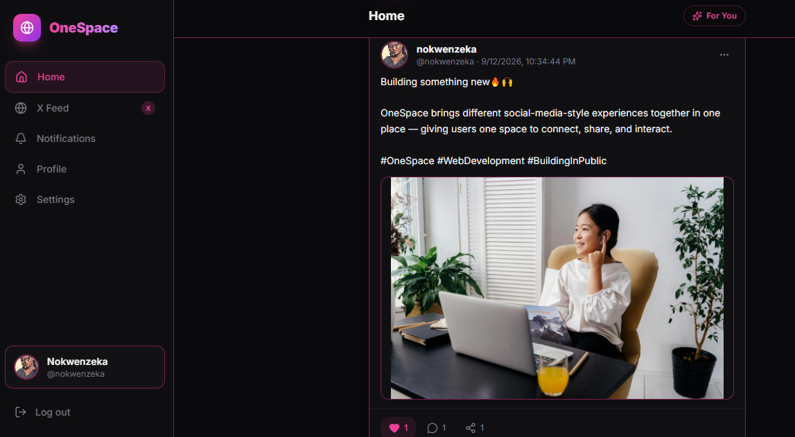
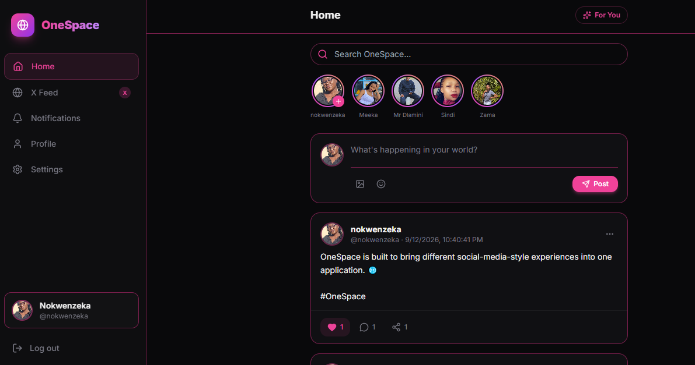
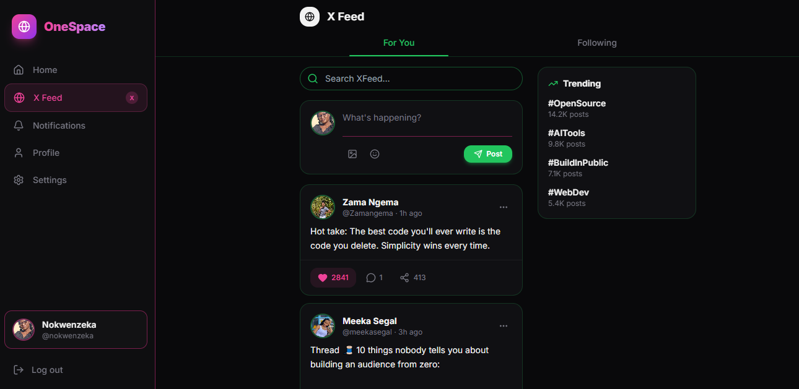
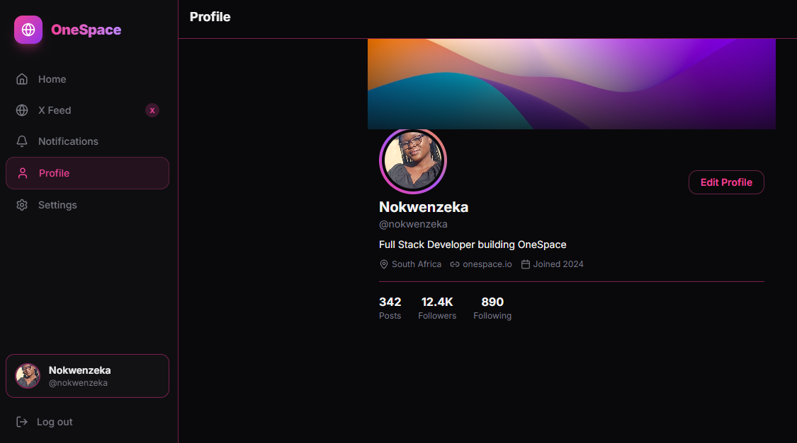

# OneSpace

OneSpace is a full-stack social media web application designed around the idea of bringing multiple social-media-style experiences into one application.

Instead of users having to leave one app and open another to experience different social platforms, OneSpace provides a single space where users can interact with different feed experiences while keeping core social features such as posting, commenting, liking, sharing, and profile management in one application.

The project was built to demonstrate practical full-stack web development skills, including React frontend development, REST APIs, authentication, database integration, file uploads, and responsive user interface design.

## The Problem

Social media users often move between different applications to access different social experiences. One application may be focused on one type of content or interaction, while another provides a different experience.

This means users have to leave one application and open another whenever they want to switch between different social-media experiences.

OneSpace was created to explore a different approach: **what if different social-media-style experiences could be accessed from one application and one central space?**

## The Solution

OneSpace provides a single application where users can access different social-media-style feed experiences without leaving the app.

The application combines a main OneSpace social feed with an X-inspired feed experience, while providing shared functionality such as authentication, posting, image uploads, comments, likes, shares, profile management, stories/status, notifications, and settings.

The goal is to create a unified social-media experience where users can move between different types of social content while remaining inside the same application.

## How It Works

1. Users create an account or log in.
2. Authentication protects the application's private areas.
3. Users can create text or image posts.
4. Posts are sent to the Express.js backend and stored in MongoDB.
5. Users can like, comment on, and share posts.
6. Users can manage their profile information and profile picture.
7. Users can create account-specific stories/status updates.
8. Users can switch between the OneSpace feed and the X-inspired feed experience.
9. The React frontend communicates with the backend API to retrieve and update user and post data.

The OneSpace Home feed is the primary full-stack experience. It is connected to the Express.js backend and MongoDB, allowing authenticated users to create and interact with persistent content.

The XFeed is currently a frontend-only experience. It provides an additional X-inspired social-media-style interface within the OneSpace application and demonstrates how multiple feed experiences can exist within the same application.

## Features

- User registration and login
- JWT-based authentication
- Protected application routes
- Create text and image posts
- Image uploads
- Persistent posts stored in MongoDB
- Like and unlike posts
- Comment on posts
- Persistent comments
- Share posts
- Account-specific profiles
- Edit profile information
- Username uniqueness validation
- Profile picture uploads
- Account-specific stories/status
- Instagram-inspired OneSpace feed
- X-inspired feed experience
- Notifications interface
- Settings interface
- Responsive navigation
- Persistent user sessions
- Default avatar fallback for accounts without profile pictures

## Tech Stack

### Frontend

- React
- Vite
- JavaScript
- JSX
- Tailwind CSS
- Framer Motion
- React Icons

### Backend

- Node.js
- Express.js
- MongoDB
- Mongoose
- JSON Web Tokens (JWT)
- bcrypt
- Multer
- CORS
- dotenv

## Project Structure

```text
onespace-v1/
├── backend/
│   ├── middleware/
│   ├── models/
│   ├── routes/
│   ├── uploads/
│   ├── .env
│   ├── package.json
│   └── server.js
├── public/
│   └── default-avatar.png
├── screenshots/
│   ├── Screenshot-login.png
│   ├── Screenshot-OneSpace-Home-image&text.png
│   ├── Screenshot-OneSpace-Home-Text.png
│   ├── Screenshot-Profile.png
│   └── Screenshot-XFeed.png
├── src/
│   ├── components/
│   ├── pages/
│   ├── assets/
│   └── ...
├── StatusBar.jsx
├── .gitignore
├── index.html
├── package.json
├── package-lock.json
├── postcss.config.js
├── tailwind.config.js
├── vite.config.js
└── README.md
```

## Screenshots

### Authentication

The OneSpace login page provides the entry point for authenticated users.



### OneSpace Home — Image Post

The main OneSpace Home feed is the primary full-stack experience, with persistent posts, image uploads, and social interactions.



### OneSpace Home — Text Post

OneSpace also supports text-only posts with likes, comments, and sharing.



### XFeed

XFeed provides an additional X-inspired social-media-style experience within the OneSpace application. It is currently implemented as a frontend-only experience.



### Profile

The profile experience allows users to manage their account information and profile.


